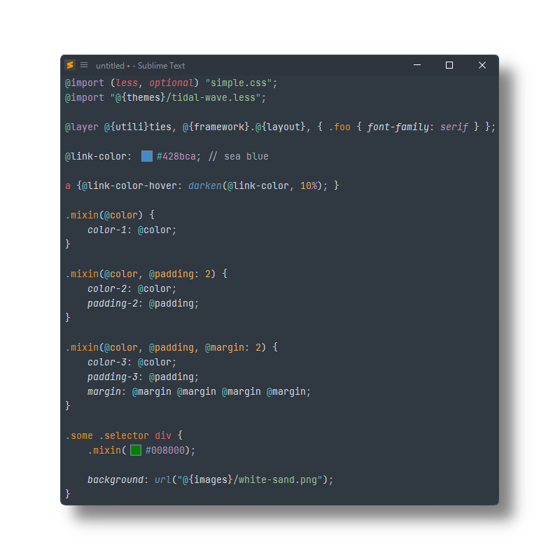

# Less

[Less](https://lesscss.org) syntax definitions for [Sublime Text](https://www.sublimetext.com) based on its CSS syntax.

Highlights `.less` (or `.css.less`) files, and provides

- snippets
- completions
- symbols

## Installation

### Package Control

The easiest way to install is using [Package Control](https://packagecontrol.io). It's listed as `Less`.

1. Open `Command Palette` using <kbd>ctrl+shift+P</kbd> or menu item `Tools → Command Palette...`
2. Choose `Package Control: Install Package`
3. Find `Less` and hit <kbd>Enter</kbd>

### Manual Install

1. Download appropriate [Less.sublime-package](https://github.com/SublimeText/Less/releases) for your Sublime Text build.
   _A suffix (e.g. `-st4xxx`) denotes the least required ST build for the sublime-package to work._
2. Rename it to _Less.sublime-package_
3. Copy it into _Installed Packages_ directory

> [!NOTE]
>
> To find _Installed Packages_...
>
> 1. call _Menu > Preferences > Browse Packages.._
> 2. Navigate to parent folder

> [!WARNING]
>
> Manually installed packages are not automatically updated by Package Control.

## Troubleshooting

Less extends Sublime Text's CSS syntax definition as of ST4149.

If Less syntax highlighting doesn't work and console displays syntax errors in _Less.sublime-syntax_, please make sure to remove any out-dated syntax override.

Steps:

1. call _Menu > Preferences > Browse Packages.._
2. Look for _CSS_ folder
3. Remove it or at least delete any _CSS.sublime-syntax_ in it
